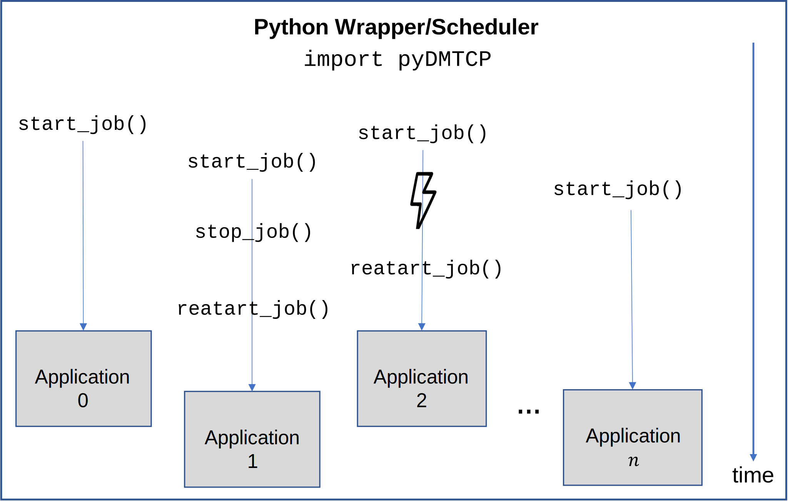

# pyDMTCP

***Python Interface to DMTCP (+SLURM)***

Supercomputers become increasingly important due to the growing demand of computational power and the amount of data that needs to be analyzed. As supercomputing systems become larger and serve many users simultaneously, the costs of building and maintaining such systems increase. Therefore, efficiency is important for both providers and users. One of the main factors of a supercomputer efficiency is the scheduling of jobs submitted by the users, to mainly increase system utilization and reduce power consumption. Meanwhile, python becomes one of the major tools/wrappers to interface scientific applications, by managing and analyzing scientific jobs conveniently. Integrating job schedulers in these tools/wrappers may increase system efficiency. DMTCP is a system-level Checkpoint/Restart (C/R) library which allows to perform C/R operations without any source code modifications. DMTCP can be utilized by scientific applications wrappers, and especially job schedulers to provide more flexibility by pausing, porting and resuming jobs. It can also be used to restart a job that crashed -- an event that becomes more common in larger supercomputers. 
A Python module, "dmtcp.py", has been created to support DMTCP checkpointing both from within an interactive Python/IPython session and programmatically from within a Python program. However, this module is used internally in python programs, and cannot support interfacing DMTCP with other black-box executables.
In this work, we extend "dmtcp.py", and firstly introduce pyDMTCP, a python module that enables python schedulers/wrappers of scientific applications to easily utilize DMTCP checkpointing via a python interface and externally to applications.

***Prerequisites***

First, clone the pyDMTCP code provided here.
clone https://github.com/Scientific-Computing-Lab-NRCN/pyDMTCP.git
Then, you should install and load the supported packages (i.e. dmtcp, openmpi) to your environment.
You will also need to install SLURM.
In addition, you should downlowd Python3.7 with the following packages:

•	dmtcp

•	openmpi

## Know Your Flags

•	--start : Specify the binary file you plan to run under pyDmtcp.

•	--compress : Define if you want to compress the dmtcp files.

•	--overwrite : Specify if you want to overwrite the last dmtcp checkpoint.

•	--rollback : Define how many checkpoint files save to rollback.

• --stop : Define the job number to stop.

• --restart : Define the job number to restart (using the dmtcp checkpoint file).

## Examples

python3 pyDMTCP.py --start hello_test.sh --compress True --overwrite True --rollback 1
